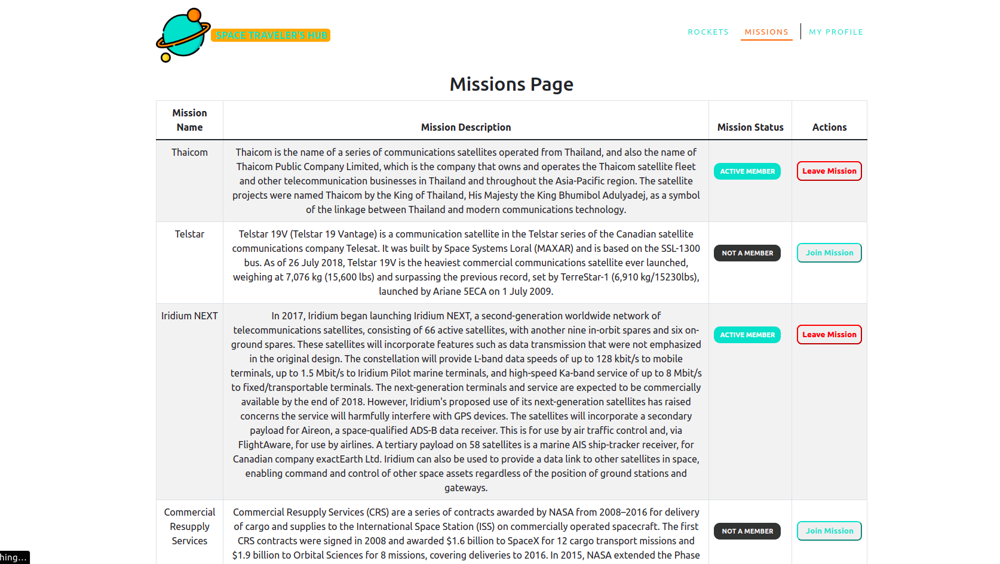
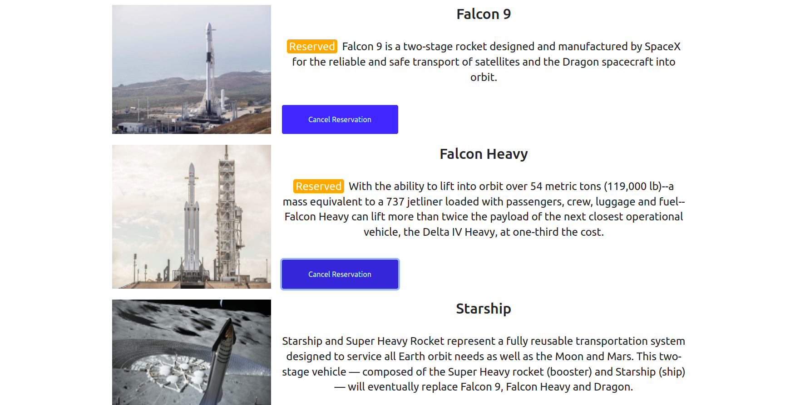
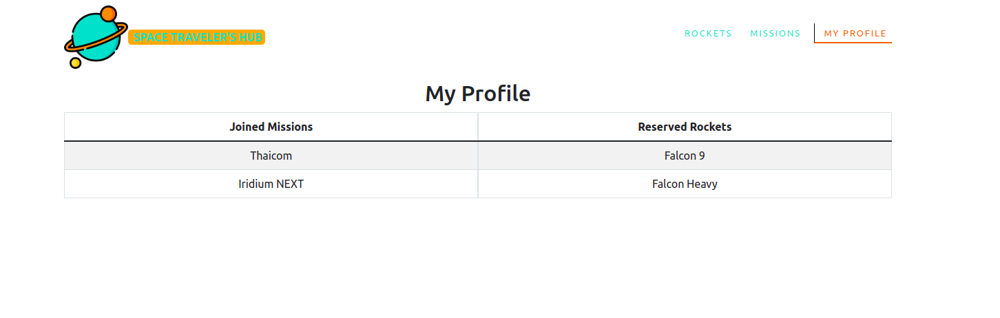

## Preview

Missions Page

Rockets Page

Profile Page

<h1 align="center">Space Travelers</h1>

> A web application for a company that provides commercial and scientific space travel services.

## Live Link 

[Space Travelers](spacex-travelers.netlify.app)

## Built With

- **REACT** and **CSS** and **Javascript**

## Getting Started

To get a local copy up and running follow these setup steps below.

### Setup

- Simply fork this project
- run `npm i `to install all dependencies
- run `npm run build` to bundle the project with webpack, and
- run `npm start` to launch the application
- Open [http://localhost:3000](http://localhost:3000) to view it in your browser.

## Authors

👤 **Authors**

- GitHub: [Ben Kiarie](https://github.com/Benmuiruri) and [Regiss Mukubiza](https://github.com/Regiss05)
- Twitter: [Optimize](https://twitter.com/_optimize)
- LinkedIn: [Ben Kiarie](https://www.linkedin.com/in/benjamin-kiarie-180b66149/)

## 🤝 Contributing

Contributions, issues, and feature requests are welcome!

Feel free to check the [issues page](https://github.com/Benmuiruri/space-travelers-hub/issues).

## Show your support

Give a ⭐️ if you like this project!

## Acknowledgments

Huge thanks to everyone who helped us in any capacity to complete this project

## 📝 License

This project is [MIT](https://opensource.org/licenses/MIT) licensed.
